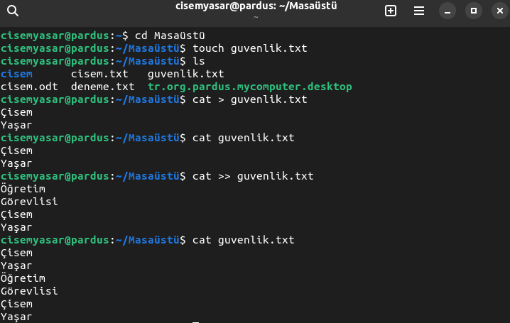

**Adı Soyadı:**
 
**Programı:** Bilişim Güvenliği Teknolojisi

## BTP152 – AÇIK KAYNAK İŞLETİM SİSTEMLERİ UYGULAMA SORULARI
  
**1.Yukarıdaki görselde gerçekleşen komut adımlarını açıklayınız?**
 
**Adım 1:** `Masaüstüne girme.`
 
**Adım 2:** `Döküman oluşturma.`
 
**Adım 3:** `Masaüstündeki bütün dosyaları listeleme.`
 
**Adım 4:** `Yeni metin açma.`
 
**Adım 5:** `Döküman içindekileri görüntüleme.`
 
**Adım 6:** `Üzerine yeni bilgi ekleme.`
 
**Adım 7:** `Görüntüleme.`
 

**2. “cat –n /etc/passwd” komutunun işlevini açıklayınız?**
 
**Açıklama:** `passwd da düzenleme ve sıralama.`

**3. $ echo Açık Kaynak > ders1.txt**
 
**$ echo İşletim Sistemi > ders2.txt**
 
**$ cat ders1.txt ders2.txt**
 
**Yukarıdaki komut bloğu çalıştırıldığında ekran çıktısı ne olur?**
 
**Ekran Çıktısı:** 
 

    Açık Kaynak
    İşletim Sistemi

**4. “Deneme.txt” dokümanı içerisinde 100 satırlık paragraf bulunmaktadır. Paragrafın sadece 2 satırını görüntülemek için kullanılan komutu yazınız?**
 
**Komut:** `more -r 2 Deneme.txt`
 

**5. Sistem yapılandırma dosyaları içerisinde bulunan “passwd” dokümanının ilk ve son 5 satırını görüntülemek için kullanılan komutu yazınız?**
 
**Komut:** `head -n 5 /etc/passwad`
 
**Komut:** `tatil -n 5 /etc/passwad`
 

**6. Masaüstünde “okul.txt” adında doküman oluşturunuz. Doküman içerisine adınızı, soyadınızı ve okuduğunuz bölüm bilgisini komut blokları ile ekleme ve görüntüleme sağlayınız. Son olarak oluşturduğunuz dokümanda karakter ve kelime sayısını bulan komut bloklarını yazınız?**
 
**Komut:** `cd Masaüstü`
 
**Komut:** `touch okul.txt`
 
**Komut:** `echo"Ali Arda Pektas"> okul.txt`
 
**Komut:** `cat okul.txt`
 
**Komut:** `wc -c okul.txt`
 
**Komut:** `wc -w okul.txt`
 

**7. Masaüstünde “ben.txt ve program.txt” adında iki adet doküman oluşturunuz.**
 
**ben.txt içerisine; ad, soyad ve memleket bilgisi ekleyin ve görüntüleme sağlayınız.**
 
**program.txt içerisine; bildiğiniz üç tane programlama dilini ekleyin ve görüntüleme sağlayınız.**
 
**Oluşturulan her iki dokümanı aralarına tab boşluğu koyarak “birlestirme.txt” dokümanı içerisine ekleyiniz.**
 
**Son olarak “komut” dizini oluşturup içerisine “birlestirme.txt” dokümanını taşıyan ve arşivleyen komut bloklarını yazınız?**
 
**Komut:** `cd Masaüstü`
 
**Komut:** `touch ben.txt`
 
**Komut:** `echo "Ali Arda Pektaş">ben.txt`
 
**Komut:** `cat ben.txt`
 
**Komut:** `touch program.txt`
 
**Komut:** `echo "Phyton,c++,Html">program.txt`
 
**Komut:** `cat program.txt`
 
**Komut:** `paste ben.txt program.txt > birlestirme.txt`
 
**Komut:** `cat birlestirme.txt`
 
**Komut:** `mkdir `
 
**Komut:** `mv birlestirme.txt`
 
**Komut:** `tar -cf arsivle.tar`
 

**8. Masaüstünde “yetki” adında dizin oluşturunuz. Dizin içerisine “yetkilendirme.txt” dokümanı oluşturup erişim izinlerini listeleyiniz. Grup ve diğer kullanıcıların erişim izinlerine yazma yetkisini veren komut bloklarını yazınız?**
 
**Komut:** `cd Masaüstü`
 
**Komut:** `mkdir yetki`
 
**Komut:**  `cd yetki`
 
**Komut:** `touch yetkilendirme.txt`
 
**Komut:** `ıs -ı yetkilendirme.txt`
 
**Komut:** `chmod go+w yetkilendirme.txt`
 
**Komut:** `ıs -ı yetkilendirme.txt`

**Lisans bu proje MIT lisansı ile lisanslanmıştır.**
